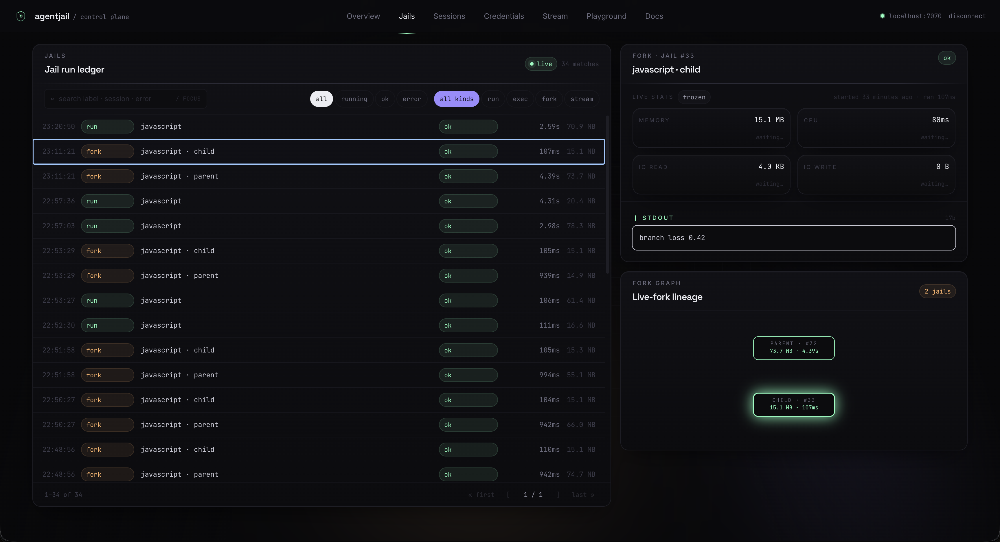

<p align="center">
  
</p>

<h1 align="center">agentjail</h1>

<p align="center">
  Minimal Linux sandboxes for running untrusted code
</p>

---

Built for AI agents, build systems, and any scenario where you need to execute code you didn't write.

> **Status — beta.** The Rust core (`crates/agentjail`) is the only piece
> currently running in production. The control plane, TypeScript and Python SDK, and
> web UI are open-source work-in-progress — useful, but expect rough
> edges. Hardening is continuous; review the threat model and pin a
> version before depending on it.

## Features

- **Rootless** — user namespaces, no setuid helper
- **Network isolation** — none, loopback, or domain allowlist via built-in CONNECT proxy
- **Filesystem isolation** — chroot with minimal mounts; Landlock on 5.13+
- **Resource limits** — memory, CPU, PIDs, disk I/O via cgroups v2
- **Syscall filtering** — seccomp-BPF blocklist (`Standard` / `Strict`)
- **GPU passthrough** _(experimental)_ — NVIDIA per-device isolation
- **OOM detection** — surfaced on the result, not silent
- **Snapshotting** — save/restore output for incremental rebuilds
- **Live forking** — clone a running jail in milliseconds via COW reflinks
- **Event streaming** — real-time stdout/stderr/lifecycle events
- **Persistent workspaces** — long-lived mount trees with multi-exec + named snapshots ([SDK ≥ 0.2](packages/sdk-node/README.md#persistent-workspaces--snapshots))

## Requirements

- Linux 5.13+, cgroups v2, user namespaces enabled
- Rust 1.85+ (edition 2024)
- `CAP_NET_ADMIN` (only for `Network::Allowlist`)

## Installation

```toml
[dependencies]
agentjail = "0.1"
tokio = { version = "1", features = ["rt", "macros"] }
```

## Quick Start

```rust
use agentjail::{Jail, preset_build};

#[tokio::main]
async fn main() -> Result<(), Box<dyn std::error::Error>> {
    let jail = Jail::new(preset_build("./src", "./out"))?;
    let result = jail.run("npm", &["run", "build"]).await?;

    println!("exit={} oom={}", result.exit_code, result.oom_killed);
    Ok(())
}
```

## Presets

Start with a preset; drop to `JailConfig` when you need to customize.

| Preset | Use case | Network | Memory | Timeout |
|--------|----------|---------|--------|---------|
| `preset_build` | Offline builds (vendored deps) | None | 512 MB | 10 min |
| `preset_install` | `npm install`, `cargo build` | Allowlist | 512 MB | 10 min |
| `preset_agent` | AI agent execution | None | 256 MB | 5 min |
| `preset_gpu` | CUDA / PyTorch / training | None | 8 GB | 1 hour |
| `preset_dev` | Dev servers (HMR) | Loopback | 1 GB | 1 hour |

`preset_install` requires explicit allowed domains:

```rust
let jail = Jail::new(preset_install("./src", "./out", vec![
    "registry.npmjs.org".into(),
    "registry.yarnpkg.com".into(),
]))?;
```

## Configuration

```rust
use agentjail::{Jail, JailConfig, Network, SeccompLevel};

let config = JailConfig {
    source: "/code".into(),           // read-only at /workspace
    output: "/artifacts".into(),      // read-write at /output
    network: Network::None,           // None | Loopback | Allowlist(_)
    seccomp: SeccompLevel::Standard,  // Standard | Strict | Disabled
    memory_mb: 512,
    cpu_percent: 100,                 // 100 = 1 core
    max_pids: 64,
    io_read_mbps: 100,                // 0 = unlimited
    io_write_mbps: 50,
    timeout_secs: 300,
    ..Default::default()
};
let jail = Jail::new(config)?;
```

### Network modes

| Mode | Access | Use case |
|------|--------|----------|
| `Network::None` | nothing | builds with vendored deps |
| `Network::Loopback` | localhost only | dev servers |
| `Network::Allowlist(_)` | listed domains only | agents, package installs |

```rust
network: Network::Allowlist(vec![
    "api.anthropic.com".into(),
    "registry.npmjs.org".into(),
    "*.mcp.company.com".into(),  // wildcards
]),
```

A built-in HTTP CONNECT proxy runs in the parent with real network. The
jail talks to it through a veth pair (configured via netlink, no `ip`
binary needed) and can't reach anything else. DNS resolves at connect
time. TLS protocols pass through unchanged — HTTPS, SSE, WebSocket (MCP).

### GPU passthrough _(experimental)_

> Exposes the NVIDIA kernel driver attack surface. Trusted workloads only.

```rust
let config = JailConfig {
    gpu: GpuConfig { enabled: true, devices: vec![0] },
    ..Default::default()
};
```

## Runtime features

### Resource monitoring

```rust
let handle = jail.spawn("npm", &["run", "build"])?;
if let Some(s) = handle.stats() {
    println!("mem={} MB io_w={} MB",
        s.memory_peak_bytes / 1_048_576,
        s.io_write_bytes   / 1_048_576);
}
let out = handle.wait().await?;
if out.oom_killed { eprintln!("OOM"); }
```

### Event streaming

```rust
let (handle, mut rx) = jail.spawn_with_events("npm", &["run", "build"])?;
while let Some(ev) = rx.recv().await {
    match ev {
        JailEvent::Stdout(l)            => println!("{l}"),
        JailEvent::Stderr(l)            => eprintln!("{l}"),
        JailEvent::OomKilled            => eprintln!("OOM"),
        JailEvent::Completed { .. }     => break,
        _ => {}
    }
}
```

### Snapshotting

```rust
let snap = Snapshot::create(&output_dir, &snapshot_dir)?;
snap.restore()?;
```

### Live forking

Clone a running jail without pausing it:

```rust
let handle = jail.spawn("python", &["train.py"])?;
let (forked, info) = jail.live_fork(Some(&handle), "/tmp/fork-out")?;
let result = forked.run("python", &["evaluate.py"]).await?;
```

Uses `FICLONE` for instant reflink copies on btrfs/xfs; falls back to
regular copy elsewhere. The original is frozen sub-millisecond via the
cgroup freezer and immediately resumed. Multiple forks work independently.

## Security

### Layers

1. **Namespaces** — mount, network, IPC, PID, user
2. **Chroot** — minimal filesystem (no host `/etc`, `/home`, `/root`)
3. **Seccomp** — comprehensive syscall blocklist
4. **Cgroups v2** — limits assigned before child execs (barrier pipe)
5. **Landlock** — filesystem ACLs (Linux 5.13+)
6. **Hardening** — `PR_SET_NO_NEW_PRIVS`, `RLIMIT_NOFILE`, `RLIMIT_CORE=0`

### What gets blocked

Each row links to the regression test that proves it. Tests live in [crates/agentjail/tests/](crates/agentjail/tests/) and run on every build.

| Attack | Protection | Verified by |
|--------|------------|-------------|
| Read `~/.ssh`, `~/.aws` | Not mounted | [`test_cannot_read_ssh_keys`](crates/agentjail/tests/security_test.rs) |
| Read `/etc/shadow`, host keys | Minimal `/etc` (only ld.so, resolv.conf, ssl) | [`test_etc_shadow_not_accessible`](crates/agentjail/tests/audit_regression_test.rs) |
| Network exfiltration | Network namespace + allowlist proxy | [`test_network_none_blocks_external`](crates/agentjail/tests/security_test.rs), [`test_allowlist_npm_install_blocked`](crates/agentjail/tests/security_test.rs), [`test_reverse_shell_blocked`](crates/agentjail/tests/security_test.rs) |
| Fork bombs | PID limit via cgroup | [`test_pid_limit_blocks_fork_bomb`](crates/agentjail/tests/audit_regression_test.rs) |
| Memory exhaustion | Memory limit + OOM detection | [`test_large_stdout_does_not_oom`](crates/agentjail/tests/audit_regression_test.rs) |
| Disk thrashing | I/O bandwidth limits | [`test_io_write_bandwidth_limit_enforced`](crates/agentjail/tests/audit_regression_test.rs) |
| Signal host processes | PID namespace | [`test_pid_namespace_full_sandbox`](crates/agentjail/tests/security_test.rs) |
| Mount manipulation | `mount`, `mount_setattr`, new mount API blocked | [`seccomp_standard_blocks_documented_syscalls`](crates/agentjail/tests/seccomp_blocklist_test.rs) |
| io_uring bypass | `io_uring_setup`/`enter`/`register` blocked | [`seccomp_standard_blocks_documented_syscalls`](crates/agentjail/tests/seccomp_blocklist_test.rs) |
| 32-bit compat escape | `personality()` blocked | [`seccomp_standard_blocks_documented_syscalls`](crates/agentjail/tests/seccomp_blocklist_test.rs) |
| Namespace escape | `clone3`, `unshare`, `setns` blocked | [`test_seccomp_blocks_unshare`](crates/agentjail/tests/audit_regression_test.rs), [`seccomp_standard_blocks_documented_syscalls`](crates/agentjail/tests/seccomp_blocklist_test.rs) |
| BPF / perf abuse | `bpf`, `perf_event_open`, `userfaultfd` blocked | [`test_seccomp_blocks_bpf`](crates/agentjail/tests/audit_regression_test.rs), [`seccomp_standard_blocks_documented_syscalls`](crates/agentjail/tests/seccomp_blocklist_test.rs) |
| Executable memory | `memfd_create` blocked | [`seccomp_standard_blocks_documented_syscalls`](crates/agentjail/tests/seccomp_blocklist_test.rs) |
| Write+execute on `/tmp` | NOEXEC mount flag | [`test_tmp_noexec`](crates/agentjail/tests/audit_regression_test.rs) |
| Setuid escalation | `PR_SET_NO_NEW_PRIVS` before exec | _no direct test (asserted by absence of namespace re-entry)_ |
| Core dump leaks | `RLIMIT_CORE=0` | [`test_rlimit_core_disabled`](crates/agentjail/tests/audit_regression_test.rs) |
| Stdout OOM of parent | Output capped at 256 MiB per stream | [`test_large_stdout_does_not_oom`](crates/agentjail/tests/audit_regression_test.rs) |
| FD exhaustion | `RLIMIT_NOFILE` capped at 4096 | [`test_fd_limit_enforced`](crates/agentjail/tests/audit_regression_test.rs) |
| Symlink traversal | Skipped in snapshots, forks, cleanup | [`test_snapshot_restore_does_not_follow_symlinks`](crates/agentjail/tests/audit_regression_test.rs), [`test_fork_symlink_in_output_not_followed`](crates/agentjail/tests/audit_regression_test.rs) |
| Zombie / fd leak on crash | `PR_SET_PDEATHSIG` + kill+reap in `Drop` | [`test_drop_handle_kills_child`](crates/agentjail/tests/audit_regression_test.rs), [`test_no_zombie_after_drop`](crates/agentjail/tests/audit_regression_test.rs) |
| PID reuse kill | Reaped flag prevents killing recycled PIDs | _internal invariant; no behavioral test_ |

Four rounds of security audit cover every source file; **90 regression tests** in the agentjail crate verify the scenarios above on every build.

## Limitations

- **Linux only** — namespaces, seccomp, cgroups v2 required
- **Not a VM** — kernel exploits could escape; use [gVisor](https://gvisor.dev) or [Firecracker](https://firecracker-microvm.github.io) if you need stronger isolation
- **GPU requires trust** — NVIDIA kernel driver attack surface
- **Allowlist proxy** — one veth pair per jail (auto-cleaned via `PR_SET_PDEATHSIG`; call `cleanup_stale_veths()` at startup for safety)

## Control plane

agentjail also ships an HTTP control plane (`agentjail-server`) with a
phantom-token credential broker, a TypeScript SDK, a Python SDK, and
a web UI.

> _Pre-release._ Not yet running in production. APIs may change. Use it
> for local development, demos, and feedback.

**Surface at a glance:**
- `POST /v1/credentials` · `POST /v1/sessions` · `POST /v1/runs` (+ `fork`, `stream`)
- `POST /v1/workspaces` (+ `/fork`, `/exec`) · `POST /v1/workspaces/:id/snapshot`
- `GET /v1/workspaces?q=…` · `GET /v1/snapshots?q=…` — server-side search
- `GET /v1/snapshots/:id/manifest` — file listing for pool-backed snapshots
- `GET /v1/jails/:id` — result + **config** the jail ran with
- `GET /v1/audit` — phantom-proxy upstream requests
- `GET /v1/config` — read-only snapshot of server settings (providers, bind addresses, GC policy, defaults)

### Web UI



React 19 + Vite + Tailwind. Pages: **Overview · Jails · Workspaces ·
Snapshots · Sessions · Credentials · Stream · Playground · Settings ·
Docs**. The Jails ledger shows live runs with per-jail stats (mem, CPU,
I/O, stdout tail), fork lineage, and the **exact config** each jail
ran with (network policy, allowlist, seccomp level, memory/timeout/CPU
caps, git seed). Workspaces and Snapshots share the ledger pattern —
server-side substring search (`q`), paging, and metadata detail panels
with recent-execs (workspaces) and file manifests (pool-backed
snapshots).

```bash
export AGENTJAIL_API_KEY=aj_local_$(openssl rand -hex 16)
docker compose -f docker-compose.platform.yml up --build
# UI:  http://localhost:3000
# API: http://localhost:7000
```

### TypeScript SDK

`@agentjail/sdk` — zero deps, Node ≥ 18. Sandboxes get phantom tokens
(`phm_<hex>`) and a `*_BASE_URL` pointing at the proxy; real API keys
never enter the jail.

```ts
import { Agentjail } from "@agentjail/sdk";

const aj = new Agentjail({
  baseUrl: "http://localhost:7000",
  apiKey: process.env.AGENTJAIL_API_KEY!,
});

await aj.credentials.put({ service: "openai", secret: process.env.OPENAI_API_KEY! });

// One-shot run.
const result = await aj.runs.create({ code: "print('hi')", language: "python" });

// Stream events.
for await (const ev of aj.runs.stream({ code, language: "python" })) {
  if (ev.type === "stdout") process.stdout.write(ev.line + "\n");
}

// Or hand a phantom env to your own sandbox.
const session = await aj.sessions.create({
  services: ["openai", "github"],
  scopes:   { github: ["/repos/my-org/*"] },
  ttlSecs:  600,
});
spawn("node", ["agent.js"], { env: { ...process.env, ...session.env } });
```

Surface: `credentials`, `sessions`, `runs` (`create` / `fork` / `stream`),
`jails`, `audit`. Full reference in
[packages/sdk-node/README.md](packages/sdk-node/README.md).

## Development

```bash
docker compose run --rm dev cargo test
( cd packages/sdk-node && npm test )
( cd web && npm run build )
```

GPU tests need an NVIDIA GPU + [Container Toolkit](https://docs.nvidia.com/datacenter/cloud-native/container-toolkit/install-guide.html):

```bash
docker compose run --rm gpu cargo test --test gpu_test -- --nocapture
```

## License

MIT
